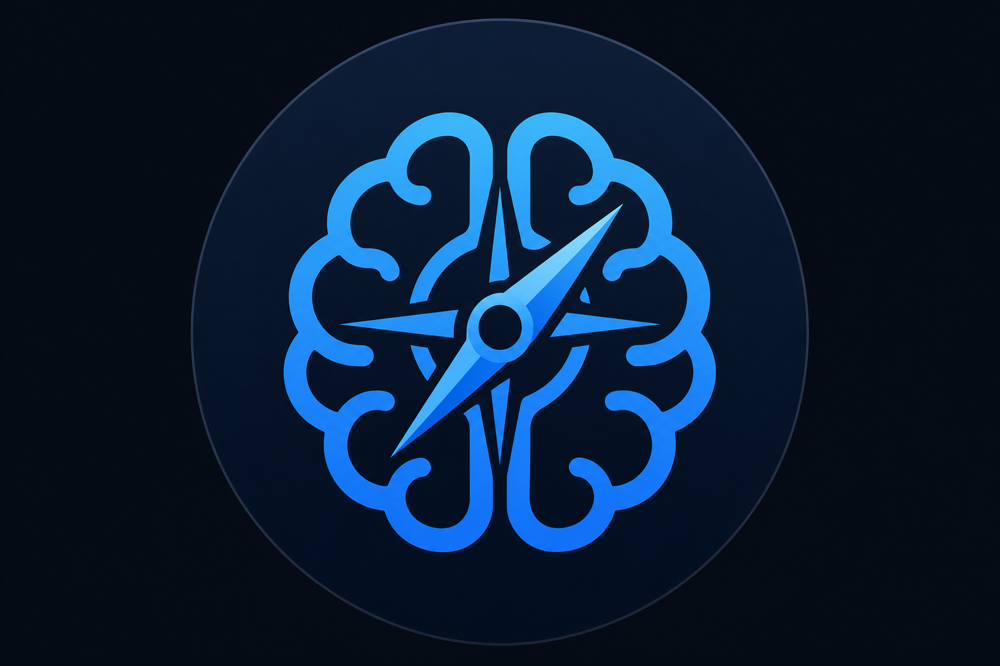
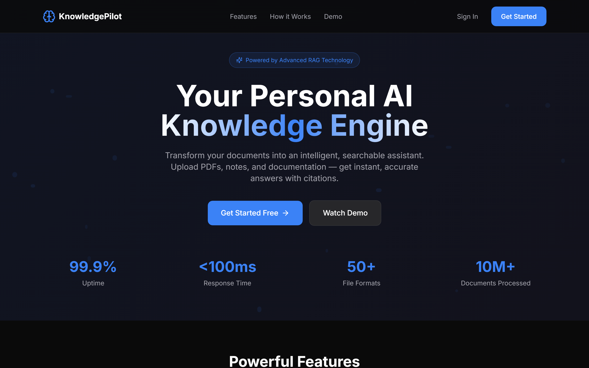
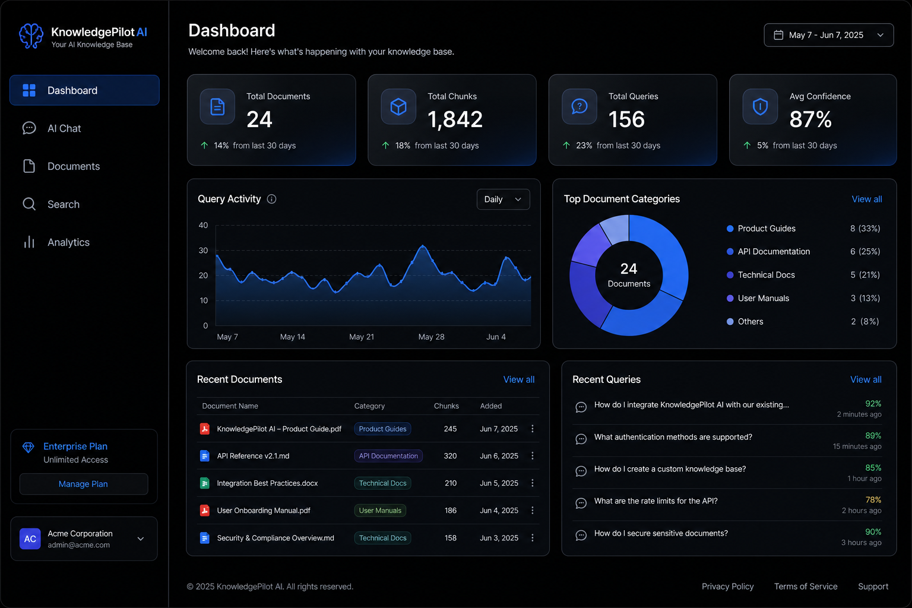
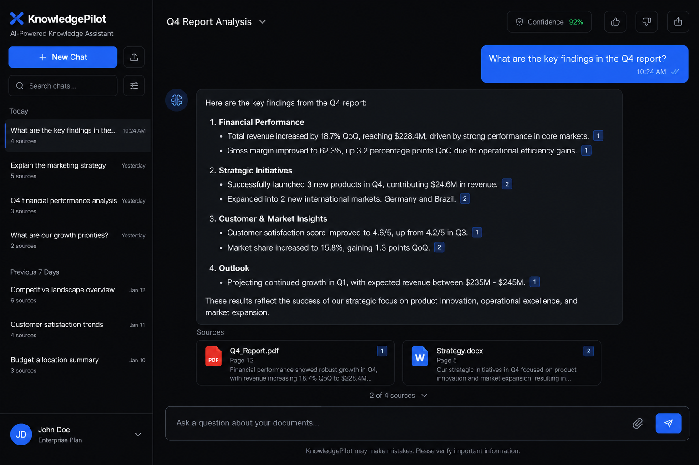
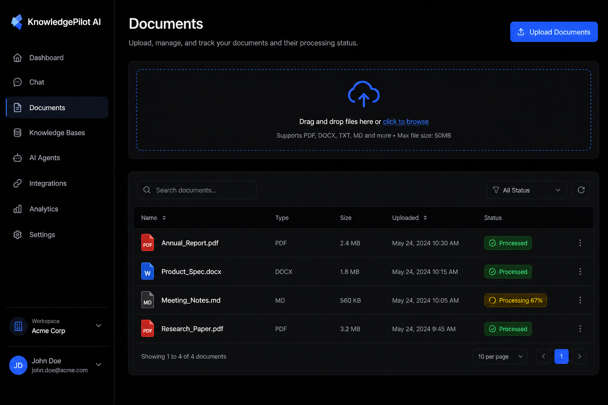
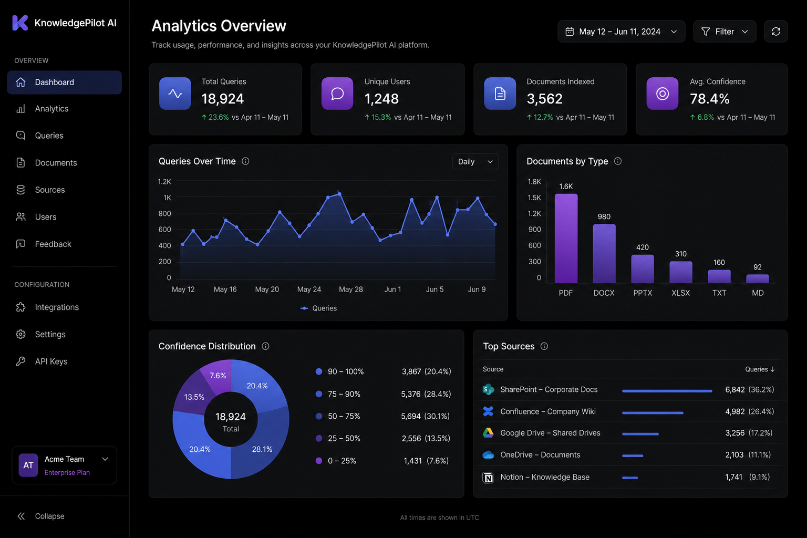

# KnowledgePilot AI

<div align="center">
  
  
  **Enterprise Personal Knowledge Base RAG Platform**
  
  [](https://github.com/sasikumarIT10/knowledgepilot-rag/actions)
  [](https://opensource.org/licenses/MIT)
  [](https://www.python.org/downloads/)
  [](https://nextjs.org/)
</div>

---

## 🚀 Overview

KnowledgePilot AI is a production-ready, enterprise-grade personal knowledge base powered by Retrieval-Augmented Generation (RAG). Transform your documents into an intelligent, searchable assistant that provides accurate answers with source citations.

### ✨ Key Features

- **📄 Multi-Format Document Ingestion** - PDF, DOCX, Markdown, TXT, HTML
- **🔍 Semantic Search** - Vector-based similarity search with ChromaDB
- **💬 AI Chat Interface** - Conversational Q&A with source citations
- **📊 Analytics Dashboard** - Track usage, performance, and knowledge growth
- **🕸️ Knowledge Graph** - Visualize document relationships
- **🔐 Enterprise Security** - JWT authentication, role-based access
- **🎨 Premium UI/UX** - Dark luxury tech theme with animations

## 📸 Screenshots

### Landing Page


### Dashboard


### AI Chat


### Documents


### Analytics


## 🏗️ Architecture

```
┌─────────────────────────────────────────────────────────────────┐
│                         Frontend (Next.js 15)                    │
│  ┌─────────────┐ ┌─────────────┐ ┌─────────────┐ ┌────────────┐ │
│  │  Landing    │ │  Dashboard  │ │  AI Chat    │ │  Analytics │ │
│  └─────────────┘ └─────────────┘ └─────────────┘ └────────────┘ │
└─────────────────────────────────────────────────────────────────┘
                              │ REST API
┌─────────────────────────────────────────────────────────────────┐
│                      Backend (FastAPI)                           │
│  ┌─────────────┐ ┌─────────────┐ ┌─────────────┐ ┌────────────┐ │
│  │    Auth     │ │  Documents  │ │    Chat     │ │   Search   │ │
│  └─────────────┘ └─────────────┘ └─────────────┘ └────────────┘ │
│                              │                                   │
│  ┌─────────────────────────────────────────────────────────────┐│
│  │                    RAG Pipeline                              ││
│  │  ┌──────────┐ ┌──────────┐ ┌──────────┐ ┌────────────────┐  ││
│  │  │ Ingestion│→│ Chunking │→│Embedding │→│  Vector Store  │  ││
│  │  └──────────┘ └──────────┘ └──────────┘ └────────────────┘  ││
│  │                              │                               ││
│  │  ┌──────────┐ ┌──────────┐ ┌──────────┐                     ││
│  │  │ Retriever│→│  Prompt  │→│   LLM    │                     ││
│  │  └──────────┘ └──────────┘ └──────────┘                     ││
│  └─────────────────────────────────────────────────────────────┘│
└─────────────────────────────────────────────────────────────────┘
                              │
┌─────────────────────────────────────────────────────────────────┐
│                        Data Layer                                │
│  ┌─────────────────────┐        ┌─────────────────────────────┐ │
│  │    PostgreSQL       │        │       ChromaDB              │ │
│  │  (Users, Documents) │        │   (Vector Embeddings)       │ │
│  └─────────────────────┘        └─────────────────────────────┘ │
└─────────────────────────────────────────────────────────────────┘
```

## 🛠️ Tech Stack

### Backend
- **Python 3.12** - Core language
- **FastAPI** - High-performance async API
- **SQLAlchemy** - ORM with async support
- **Pydantic** - Data validation
- **LangChain** - RAG orchestration
- **ChromaDB** - Vector database
- **OpenAI/Anthropic** - LLM providers

### Frontend
- **Next.js 15** - React framework
- **TypeScript** - Type safety
- **TailwindCSS** - Styling
- **Framer Motion** - Animations
- **React Query** - Data fetching
- **Zustand** - State management

### DevOps
- **Docker** - Containerization
- **GitHub Actions** - CI/CD
- **PostgreSQL** - Database

## 🚀 Quick Start

### Prerequisites
- Python 3.12+
- Node.js 20+
- Docker & Docker Compose
- OpenAI API Key

### Installation

1. **Clone the repository**
```bash
git clone https://github.com/sasikumarIT10/knowledgepilot-rag.git
cd knowledgepilot-rag
```

2. **Set up environment variables**
```bash
# Backend
cp backend/.env.example backend/.env
# Edit backend/.env with your API keys

# Frontend
cp frontend/.env.example frontend/.env.local
```

3. **Start with Docker Compose**
```bash
docker-compose up -d
```

4. **Access the application**
- Frontend: http://localhost:3000
- Backend API: http://localhost:8000
- API Docs: http://localhost:8000/docs

### Manual Setup

#### Backend
```bash
cd backend
python -m venv venv
source venv/bin/activate  # Windows: venv\Scripts\activate
pip install -r requirements.txt
uvicorn app.main:app --reload
```

#### Frontend
```bash
cd frontend
npm install
npm run dev
```

## 📖 API Documentation

### Authentication
```http
POST /api/v1/auth/register
POST /api/v1/auth/login
POST /api/v1/auth/refresh
GET  /api/v1/auth/me
```

### Documents
```http
POST /api/v1/documents/upload
GET  /api/v1/documents
GET  /api/v1/documents/{id}
GET  /api/v1/documents/{id}/status
DELETE /api/v1/documents/{id}
```

### Chat
```http
POST /api/v1/chat
POST /api/v1/chat/stream
GET  /api/v1/chat/sessions
GET  /api/v1/chat/sessions/{id}
```

### Search
```http
GET /api/v1/search?q={query}
GET /api/v1/search/hybrid
```

## 🧪 Testing

### Backend
```bash
cd backend
pytest --cov=app
```

### Frontend
```bash
cd frontend
npm test
```

## 📁 Project Structure

```
knowledgepilot/
├── backend/
│   ├── app/
│   │   ├── api/v1/endpoints/    # API routes
│   │   ├── core/                # Security, logging
│   │   ├── db/                  # Database models
│   │   ├── schemas/             # Pydantic schemas
│   │   ├── services/            # Business logic
│   │   ├── ingestion/           # Document loaders
│   │   ├── chunking/            # Text chunkers
│   │   ├── embeddings/          # Embedding providers
│   │   ├── vectordb/            # Vector stores
│   │   └── rag/                 # RAG pipeline
│   ├── requirements.txt
│   └── Dockerfile
├── frontend/
│   ├── src/
│   │   ├── app/                 # Next.js pages
│   │   ├── components/          # React components
│   │   └── lib/                 # Utilities, API, store
│   ├── package.json
│   └── Dockerfile
├── docker-compose.yml
└── README.md
```

## 🔧 Configuration

### Environment Variables

| Variable | Description | Default |
|----------|-------------|---------|
| `OPENAI_API_KEY` | OpenAI API key | Required |
| `DATABASE_URL` | PostgreSQL connection | `sqlite+aiosqlite:///./data/app.db` |
| `JWT_SECRET_KEY` | JWT signing key | Required |
| `CHROMA_PERSIST_DIRECTORY` | ChromaDB storage | `./data/chroma` |

## 🤝 Contributing

1. Fork the repository
2. Create a feature branch (`git checkout -b feature/amazing`)
3. Commit changes (`git commit -m 'Add amazing feature'`)
4. Push to branch (`git push origin feature/amazing`)
5. Open a Pull Request

## 📄 License

This project is licensed under the MIT License - see the [LICENSE](LICENSE) file.

## 🙏 Acknowledgments

- [LangChain](https://langchain.com/) - RAG framework
- [ChromaDB](https://www.trychroma.com/) - Vector database
- [OpenAI](https://openai.com/) - LLM provider
- [Vercel](https://vercel.com/) - Next.js framework

---

<div align="center">
  Built with ❤️ for knowledge seekers
</div>
